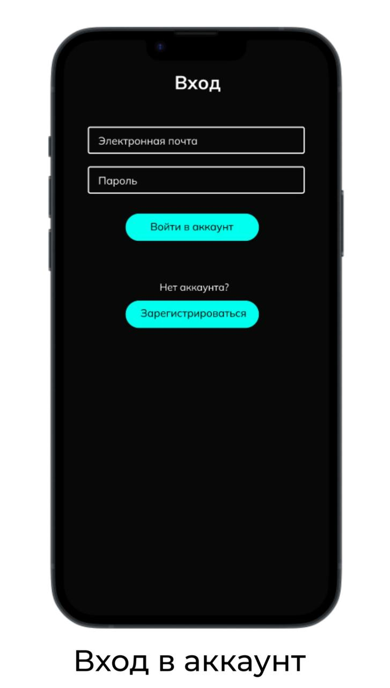
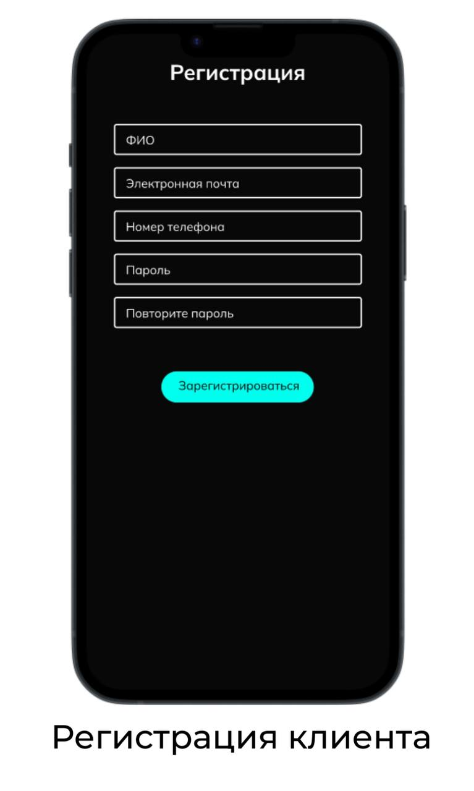
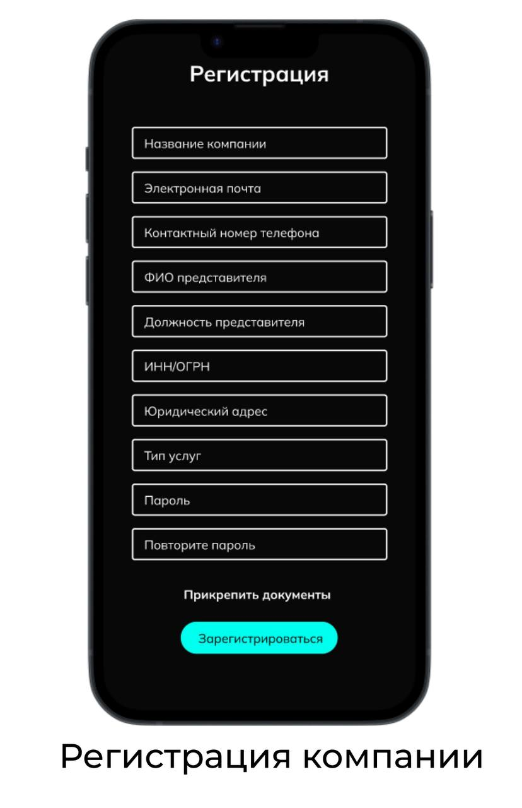
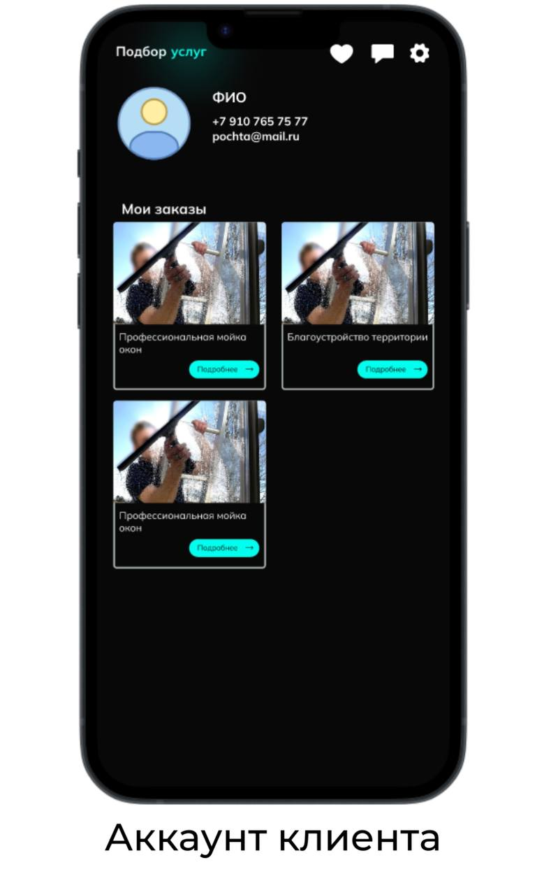
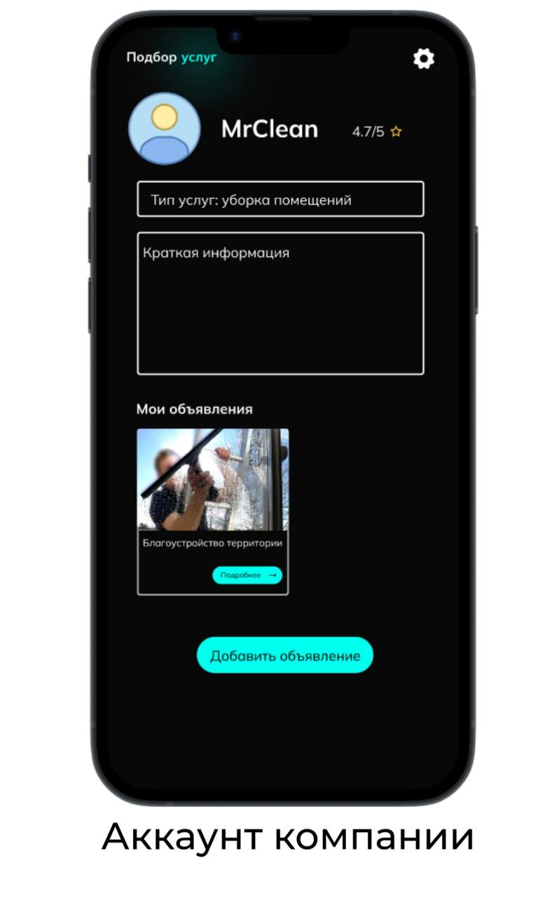

## Microservice outsourcing-auth

## 🚀 How to run
1. `git clone git@github.com:APSN4/outsourcing-auth.git`.
2. `cd outsourcing-auth`.
3. Create an env file in the root directory.
4. `docker-compose up -d --build`

### ENV:
`.env` - file with secrets.  
```
POSTGRES_USER=user
POSTGRES_PW=password
POSTGRES_DB=outsourcing
POSTGRES_HOST=postgres
POSTGRES_PORT=5432
PGADMIN_MAIL=your@example.com
PGADMIN_PW=password
KEY_JWT=secret-key-256
LIFE_TIME_JWT=3600
```

### Postgres & pgAdmin
Create and start the containers. Make sure that you’re inside
the directory that contains the docker-compose.yml file and run: `docker compose up`.

If you want to use pgAdmin, check out this guide: https://cpit490.gitlab.io/notes/docker-compose-pgsql-pgadmin/  

## 📖 API Documentation

### Login into account

Authorization for companies and clients. When the user is logged in, they will have a token that represents a valid session.



**URL** : `v1/login`

**Method** : `POST`

**Auth required** : NO

**Permissions required** : None

**Attributes:**
* email
* password

```json
{
  "user": {
    "login": {
      "email": "myemail@gmail.com",
      "password_hash": "hash"
    }
  }
}
```

### Success Response

**Code** : `200 OK`

**Content examples**

For a user with an email address myemail@gmail.com and with some password, 
the server service will send a text status code, user ID, session token, and account type:  

```json
{
  "status": "success",
  "user": {
    "id": 123,
    "token": "token",
    "type": "client"
  }
}
```

----------
### Client registration

This API provides client registration, 
and the server service sends a text status code, user ID, session token, and account type:  



**URL** : `v1/register/client`

**Method** : `POST`

**Auth required** : NO

**Permissions required** : None

**Attributes:**
* Full_name
* Email
* Phone
* Password
* Photo (not necessary)
* Account type

```json
{
  "user": {
    "register": {
      "full_name": "name surname patronymic",
      "email": "myemail@gmail.com",
      "phone": "89017335432",
      "password": "hash",
      "photo": null,
      "type": "client"
    }
  }
}
```

### Success Response

**Code** : `200 OK`

**Content examples**

For a client with attributes, 
the server service will send a text status code, user ID, session token, and account type:  

```json
{
  "status": "success",
  "user": {
    "id": 123,
    "token": "token",
    "type": "client"
  }
}
```

----------
### Company registration

This API provides company registration,
and the server service sends a text status code, user ID, session token, and account type:



**URL** : `v1/register/company`

**Method** : `POST`

**Auth required** : NO

**Permissions required** : None

**Attributes:**
* Company_name
* Email
* Phone
* Full_name
* Position_agent
* ID_company (INN/OGRN)
* Address
* Type_service
* Password
* Photo (not necessary)
* Account type
* Docs urls

```json
{
  "user": {
    "register": {
      "company_name": "Apple",
      "email": "myemail@gmail.com",
      "phone": "89017335432",
      "full_name": "name surname patronymic",
      "position_agent": "CEO",
      "id_company": "00000000",
      "address": "Moscow, Leninskiy prospekt, dom 7",
      "type_service": "Car dealership",
      "password": "hash",
      "photo": null,
      "documents": ["link", "link"],
      "type": "company"
    }
  }
}
```

### Success Response

**Code** : `200 OK`

**Content examples**

For a company with attributes,
the server service will send a text status code, user ID, session token, and account type:

```json
{
  "status": "success",
  "user": {
    "id": 123,
    "token": "token",
    "type": "company"
  }
}
```

----------
### Client/Company account

This API provides company and client account by session token,
and the server service sends a text status code, user ID, session token, and account type:

  


**URL** : `v1/account`

**Method** : `POST`

**Auth required** : YES

**Permissions required** : None

**Attributes:**
* Token

```json
{
  "user": {
    "login": {
      "token": "token"
    }
  }
}
```

### Success Response

**Code** : `200 OK`

**Content examples**

For a **client**,
the server service will send a text status code, user ID, full name, phone, email, photo url, session token, and account type:

```json
{
  "status": "success",
  "user": {
    "account": {
      "id": 123,
      "full_name": "name surname patronymic",
      "phone": "89017335432",
      "email": "myemail@gmail.com",
      "photo": "photo_url",
      "token": "token",
      "type": "client"
    }
  }
}
```
----------
**Code** : `200 OK`

**Content examples**

For a **company**,
the server service will send a text status code, user ID, company name, stars, email, photo url, session token, and account type:

```json
{
  "status": "success",
  "user": {
    "account": {
      "id": 123,
      "company_name": "Apple",
      "stars": 4.7,
      "email": "myemail@gmail.com",
      "photo": "photo_url",
      "token": "token",
      "type": "company"
    }
  }
}
```

----------
### Cards system [Create]

This API provides interaction with company service cards.

**URL** : `v1/account/card/create`

**Method** : `POST`

**Auth required** : YES

**Permissions required** : None

**Attributes:**
* Token
* Title
* Description

```json
{
  "user": {
    "login": {
      "token": "token"
    }
  },
  "card": {
    "title": "This is a title",
    "description": "This is a description"
  }
}
```

### Success Response

**Code** : `200 OK`

**Content examples**

```json
{
  "card": {
    "company_id": 1,
    "description": "This is a description",
    "id": 1,
    "title": "This is a title"
  }
}
```

----------
### Cards system [List]

This API provides interaction with company service cards.  
You can use queries in a POST request. Available parameters are `limit` and `page`, which create opportunities for pagination.  

**URL** : `v1/account/card/list`

**Method** : `POST`

**Auth required** : YES

**Permissions required** : None

**Attributes:**
* Token

```json
{
  "user": {
    "login": {
      "token": "token"
    }
  }
}
```

### Success Response

**Code** : `200 OK`

**Content examples**

```json
{
  "cards": [
    {
      "id": 1,
      "title": "This is a title",
      "description": "This is a description",
      "company_id": 1
    },
    {
      "id": 2,
      "title": "This is a title2",
      "description": "This is a description2",
      "company_id": 1
    }
  ]
}
```
#### 📌 We can change limit:

**URL** : `v1/account/card/list?limit=1&page=0`

**Method** : `POST`

**Auth required** : YES

**Permissions required** : None

**Attributes:**
* Token

```json
{
  "user": {
    "login": {
      "token": "token"
    }
  }
}
```

### Success Response

**Code** : `200 OK`

**Content examples**

```json
{
  "cards": [
    {
      "id": 1,
      "title": "This is a title",
      "description": "This is a description",
      "company_id": 1
    }
  ]
}
```
#### 📌 We can change pages:

**URL** : `v1/account/card/list?limit=1&page=1`

**Method** : `POST`

**Auth required** : YES

**Permissions required** : None

**Attributes:**
* Token

```json
{
  "user": {
    "login": {
      "token": "token"
    }
  }
}
```

### Success Response

**Code** : `200 OK`

**Content examples**

```json
{
  "cards": [
    {
      "id": 2,
      "title": "This is a title2",
      "description": "This is a description2",
      "company_id": 1
    }
  ]
}
```

----------
### Cards system [Delete]

This API provides interaction with company service cards.  
This will write a `deleted_at` mark and store it in the database without access.  

**URL** : `v1/account/card/delete`

**Method** : `POST`

**Auth required** : YES

**Permissions required** : None

**Attributes:**
* Token

```json
{
  "user": {
    "login": {
      "token": "token"
    }
  },
  "card": {
    "id": 1
  }
}
```

### Success Response

**Code** : `200 OK`

**Content examples**

```json
{
  "card": {
    "action": "deleted",
    "status": "success"
  }
}
```
----------

## Notes

* This API created by UI design reference.
* `Stars` - this is a rating system (now it's a mock)
* `Session token` - this is an authentication token (which we can use to identify the user)